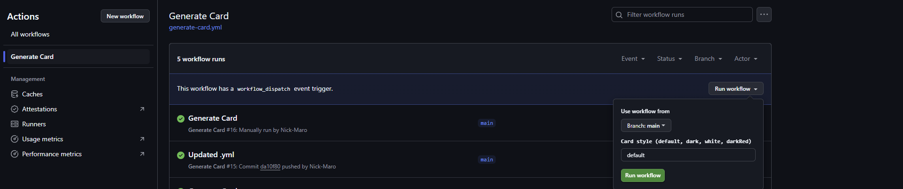

# Olicyber Badge Generator

A github workflow to generate cards like this:


# How To
- [Automated Workflow](#automated-workflow)
- [Local Generation](#local-generation)

## Auth Token
Go to the [Training Platform](training.olicyber.it), login. Then use the dev-tools to view the local storage and get your token.


## Automated workflow
Fork the repo, then go to **Settings -> Secrets and variables -> Actions**

Create a new secret named `OC_TOKEN` and insert the previously retrieved token

## Manual Update Trigger
The card is updated everyday at midnight (`UTC+1`) but you can update it manually:

Proceed to **Actions -> Generate Card (on the left) -> Run workflow**



## Embedding
You now have to insert
```html

```
in your github profile README

## Local Generation
```sh
export OC_TOKEN=*****
python3 gen.py
```
The card will be saved in the execution dir as `card.svg`
